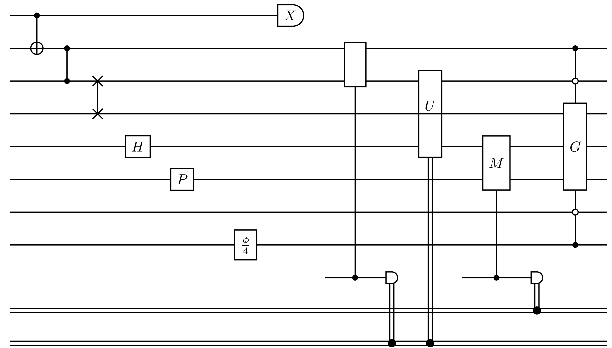

# Quantikz.jl

[](https://krastanov.github.io/Quantikz/stable)
[](https://krastanov.github.io/Quantikz/dev)
[](https://github.com/Krastanov/Quantikz/actions?query=workflow%3ACI+branch%3Amain)
[](https://codecov.io/gh/Krastanov/Quantikz)

A minimal package for drawing quantum circuits using the `quantikz` and `tikz` TeX libraries.

To install it use:

```julia
] add Quantikz
```

The library can generate `tex`, `pdf`, and `png` files, as well as live previews. It does not require anything to be installed on your system (the `tex` and image manipulation dependencies are handled by Julia, with `Tectonic.jl` and `FileIO.jl`). If you want to generate another image type, simply use `FileIO`.

```julia
circuit = [CNOT(1,2),Measurement(2)]
displaycircuit(circuit) # you can set a scale parameter
```

To save a png/pdf file:

```julia
savecircuit(circuit, "file.png") # you can set a scale parameter
savecircuit(circuit, "file.pdf")
```

You can view the corresponding TeX string or save it to file with:

```julia
circuit2string(circuit)
savetex(circuit, "file.tex")
```

## Example

```julia
circuit = [
    CNOT(1,2), CPHASE(2,3), SWAP(3,4),
    H(5), P(6), Id(7),
    U("\\frac{\\phi}{4}",8),
    Measurement("X",1), Measurement([2,3],2), ClassicalDecision("U",[3,5],2),
    Measurement("M",[5,6],1),
    MultiControlU("G",[2,8],[7,3],[4,5,6])]
```

In standard mode:


And expanded for easier identification:


## Built-in quantum circuit operations

`CNOT`, `CPHASE`, `SWAP`, `H`, `P`, `Id`, a generic single qubit gate `U`, a generic measurement `Measurement`, a classically conditioned gate `ClassicalDecision`, and a parity check measurement `ParityMeasurement`.

The general purpose `MultiControl(controls, ocontrols, targets, targetXs)` can be used to create an arbitrary combination of muticontrol multiqubit gates. Each argument lists the indices of qubits that should get a certain symbol: `controls` is filled circles, `ocontrols` is empty circles, `targets` is the NOT symbol, and `targetXs` is the X symbols.

For named controled gates use `MultiControlU(str, controls, ocontrols, targets)`.

For noise events, you can use `Noise(targets)` or `NoiseAll()`.

For examples of these operations, see the [attached notebook](https://github.com/Krastanov/Quantikz/blob/main/Quantikz.ipynb).

## Custom objects

For your `CustomQuantumOperation` simply define a `QuantikzOp(op::CustomQuantumOperation)` that converts your object to one of the built-in objects.

If you need more freedom for your custom quantum operation, simply define:
- `update_table!(table,step,op::CustomQuantumOperation)` that directly modifies the `quantikz` table
- `affectedqubits(op::CustomQuantumOperation)` that gives the indices of qubits involved in the operation.
- (optional) `affectedbits(op)` that gives the indices of classical bits in use (empty by default)
- (optional) `neededancillaries(op)` that gives the number of temporary ancillary qubits to reserve (0 by default)
- (optional) `nsteps(op)` that gives the number of steps involved in the gate (1 by default)
- (optional) `deleteoutputs(op)` that gives which qubits to be deleted, e.g., their lines removed (empty by default)

Instead of returning an array of indices `affectedqubits` can also return the lazy slice `ibegin:iend` (from `EndpointRanges.jl`) which tells the layout engine that all qubits are used in this stage of the circuit.

Internally, this library converts the array of circuit operations to a 2D array of `quantikz` macros which is then converted to a single TeX string, which is then compiled with a call to `Tectonic.jl`.

## Under the hood

If you need some of the more advanced features of the `quantikz` TeX macros that are not implemented here yet, you can edit the string directly, or more conveniently, you can generate the 2D array of macros that makes up the string:

```
julia> circuit2table([CNOT(1,2),CNOT(2,3)])
3×4 Array{String,2}:
 "\\qw"  "\\ctrl{1}"  "\\qw"       "\\qw"
 "\\qw"  "\\targ{}"   "\\ctrl{1}"  "\\qw"
 "\\qw"  "\\qw"       "\\targ{}"   "\\qw"
```

`table2string` (and `string2image`) can be used for the final conversion.

### LaTeX-free alternatives

An alternative is the [`YaoPlots.jl`](https://github.com/QuantumBFS/YaoPlots.jl) which can draw directly from Julia (does not shell out to ImageMagick and Ghostscript). `YaoPlots.jl` however does not support LaTeX.
